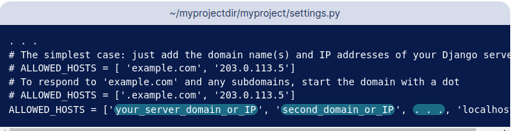

##  Обновляем и устанавлием необходимые пакеты

```
sudo apt update
sudo apt install python3-pip python3-dev python3-venv libpq-dev postgresql postgresql-contrib nginx curl
```

## Создаем базу данных PostgreSQL и настраиваем ее

#### Входим в систему 
```
sudo -u postgres psql
```

#### Создаем базу данных

```
CREATE DATABASE myproject;
```

#### Создаем пользователя 

```
CREATE USER serhii WITH PASSWORD '123';
```

#### Настройки для django 

```
ALTER ROLE serhii SET client_encoding TO 'utf8';
ALTER ROLE serhii SET default_transaction_isolation TO 'read committed';
```

#### Предоставляем доступ пользователю
```
GRANT ALL PRIVILEGES ON DATABASE myproject TO serhii;
```

#### Выходим из консоли PostgresSQL
```
\q
```

## Создаем виртуальную среду и необходимые пакеты

#### Создаем директорию и переходим в неё
```commandline
mkdir project1 && cd project1
```

#### Устанавливаем пакет виртуальной среды
```commandline
python3 -m venv venv
```
#### Активируем 
```
source venv/bin/activate
```
#### Обновляем пакеты
```
pip install -U pip setuptools
```

#### Ставим нужные пакеты
```
pip install django gunicorn psycopg2-binary
```

## Создание проекта Django

```
django-admin startproject config .
```

прописываем ALLOWED_HOSTS


указываем данные для PostgreSQL


прописываем путь до статики


#### Выполним миграции
```
python manage.py migrate
```

#### Создаем супер пользователя
```
python manage.py createsuperuser
```
#### Собираем статические файлы 
```
python manage.py collectstatic
```

#### ЗАдаем права на использование 8000 порта
```commandline
sudo ufw allow 8000
```

#### Запускаем сервер django
```
python manage.py runserver 0.0.0.0:8000
```
#### Текст работоспособности gunicorn
```commandline
cd project1
```
```commandline
gunicorn --bind 0.0.0.0:8000 config.wsgi
```

## Создание файлов сокета и служебных файлов systemd для Gunicorn

```commandline
deactivate
```

#### Создайте и откройте файл сокета systemd для Gunicorn с привилегиями
```commandline
sudo nano /etc/systemd/system/gunicorn.socket
```
#### Теперь создайте и откройте служебный файл systemd для Gunicorn 
```commandline
sudo nano /etc/systemd/system/gunicorn.service
```
```commandline
sudo systemctl start gunicorn.socket
```
```commandline
sudo systemctl enable gunicorn.socket
```
#### Проверка файла сокета Gunicorn

```commandline
sudo systemctl status gunicorn.socket
```

```commandline
file /run/gunicorn.sock
```
#### Тестирование активации сокета

```commandline
sudo systemctl status gunicorn
```

```commandline
curl --unix-socket /run/gunicorn.sock localhost
```

## Настройка Nginx >= 1.22 как прокси для Gunicorn 

в файл по пути /etc/nginx/conf.d/default.conf дописываем параметры конфига


проверка синтаксиса nginx
```
sudo nginx -t
```
```commandline
sudo systemctl restart nginx
```
```commandline
sudo ufw delete allow 8000
```
```commandline
sudo ufw allow 'Nginx Full'
```
```
sudo systemctl restart gunicorn
```


