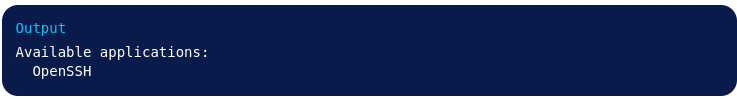
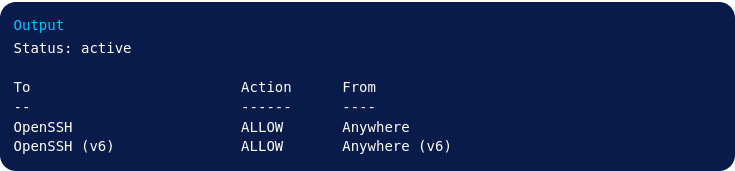

#### Шаг 1 — Вход в систему как root

```commandline
ssh root@your_server_ip
```
#### Шаг 2 — Создание нового пользователя

```commandline
adduser serhii
```

#### Шаг 3 — Предоставление административных привилегий

```commandline
usermod -aG sudo serhii
```

#### Шаг 4 — Настройка базового брандмауэра
```commandline
ufw app list
```



```commandline
ufw allow OpenSSH
```

```commandline
ufw enable
```

```commandline
ufw status
```



#### Шаг 5 — Включение внешнего доступа для вашего обычного пользователя

```commandline
ssh serhii@your_server_ip
```
